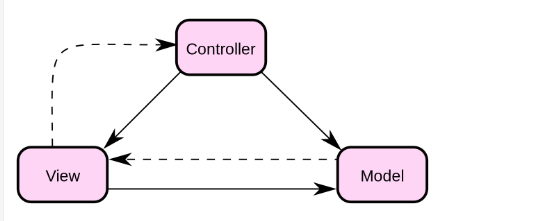

# MVC 模式

概念解释：

- MVC(Model-View-Controller) 即模型-视图-控制器，用于应用模型的分层开发。
  - Model(模型) ：一个存储数据的对象或者是JAVA POJO，也可以写一些逻辑，在数据变化的时候进行控制器的更新。
  - View(视图)：模型包含的数据的可视化。
  - Controller(控制器)：其作用在模型和视图上。控制数据流向模型对象，并在数据变化的时候进行视图的更新，其很好的将视图和模型进行了解耦。

关系图：

关系类图：

