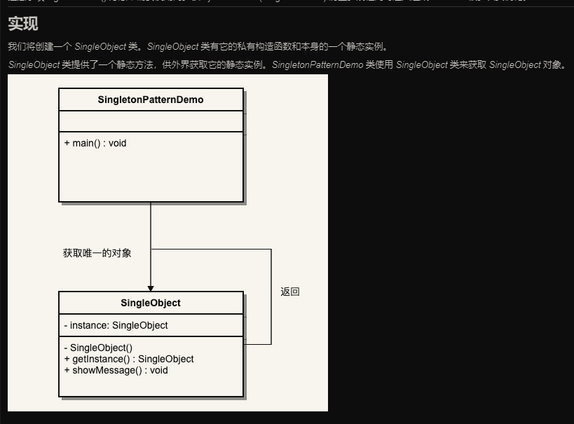

# 单例模式

## 单例模式解释 

- 单例模式是一种创建型模式，它提供了一种创建对象的最佳方式
  - 这种模式涉及到一个单一的类，该类负责创建自己的对象，同时确保只有单个对象能被创建。
  - 这个类提供了一种访问其唯一的对象的方式，可以直接访问，不需要实例化该类的对象。

> 注意事项：
>   单例类只有一个实例对象。
>   单例类必须要自己创建自己的唯一实例。
>   单例类必须给所有其他对象提供这一实例。
> 
> **注意点**： getInstance()方法中需要使用同步锁 synchronized(Singleton.class) 防止多线程同时进入造成 instance 被多次实例化。

## 单例模式详解

- 单例模式的设计目的：
  - 保证一个类有且仅有一个实例，并提供一个访问它的全局访问点。
  
- 解决的问题：
  - 一个全局使用的类频繁地创建和销毁。
  
- 使用时机：
  - 想要控制实例数目，节约系统资源。
  - 使用细则：判断系统是否已经有这个单例，若已经存在，则返回，若不存在，则创建。

- 关键代码：
  - 实例对象是 static 自己内部创建的私有的
  - 构造函数时私有的
  - 拥有唯一获取实例的方法

## 单例模式地应用

- 应用实例
  - 一个班级只有一个班主任
  - Windows 是多进程多线程地，在操作一个文件时，就不可避免地出现多个进程或者多线程同时操作一个文件的现象，所以所有文件的处理必须通过唯一的实例进行。
  - 一些设备管理器常常设计为单例模式，如一个计算机拥有两台打印机，在输出的时候就要进行处理，不能让两台打印机打印同一份文件。

- 使用场景
  - 要求生产唯一序列号
  - WEB 中的计数器，不用每次刷新都在数据库里加一次，使用单例先缓存起来。
  - 创建的一个对象需要消耗的资源过多，比如 I/O 与数据库的连接等。

## 单例模式的优劣

- 优势：
  - 在内存里只有一个实例，减少了内存的开销，尤其是频繁地创建和销毁实例。
  - 避免对资源的多重占用（写文件操作等）。

- 劣势：
  - 没有接口，不能继承，与单一职责原则冲突（一个类应该只关心内部逻辑，而不关心外面怎么样实例化）。

## 代码案例类图

## 单例模式地创建方式